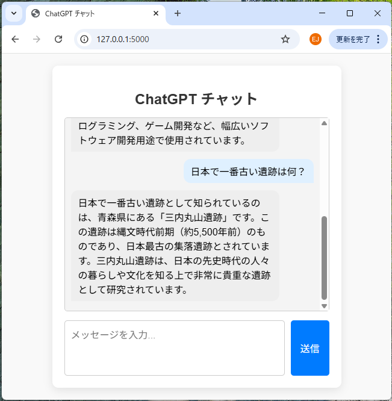
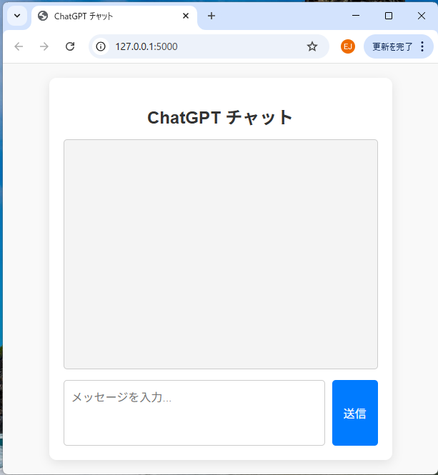
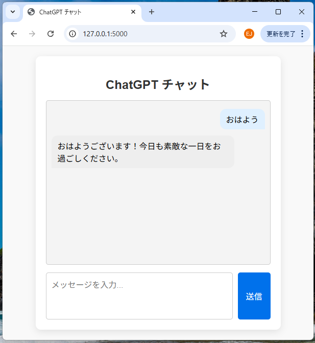

# 🤖 ChatGPT風 履歴付きチャットボット (Flaskアプリ)

## 🔹 アプリ概要

OpenAI API (モデル: `gpt-3.5-turbo`) を利用した、チャット履歴を保持しながら対話する Flask アプリです。

ユーザーからの入力をもとに OpenAI API とやりとりし、履歴付きで描画するWebチャットを実現します。

---

## ✨ 機能 / 特徴

- ✅ FlaskアプリとHTMLフォームでシンプルなチャットUI
- ✅ OpenAI APIと連携 (`gpt-3.5-turbo`)
- ✅ チャット履歴保持 (ページ内の持続のみ)
- ✅ 現在日付の情報を与えて正しい日付を応答
- ✅ JavaScriptでチャット表示後に**自動スクロール**

---

## 👀 画面イメージ

| チャット画面 | 内容             |
|----------------|----------------------|
| → 入力フォーム     | ユーザーからのメッセージ|
| → 履歴表示        | OpenAI APIとの履歴   |
| → 自動スクロール  | 最新メッセージまで移動 |

---
### ■ 初期画面（稼働時）

### ■ 初回入力（履歴表示）

### ■ 履歴画面自動（下へ）スクロール


## ⚙️ 使用技術 / ライブラリ

| 技術         | 説明                 |
|--------------|----------------------|
| Python       | バックエンド言語         |
| Flask        | 軽量なWebフレームワーク   |
| HTML / CSS   | UIのマークアップ・スタイル |
| OpenAI       | `gpt-3.5-turbo`を使用   |
| dotenv       | API Keyの暗号化ロード      |
| JavaScript   | 自動スクロール制御         |

---

## 🚀 起動方法

### 1. 必要なライブラリをインストール

```bash
pip install flask python-dotenv openai
```

### 2. OpenAI API Key を `.env` に保存

```env
OPENAI_API_KEY=sk-xxxxxxx
```

### 3. アプリを起動

```bash
python chatgpt_flask_chatbot.py
```

### 4. ブラウザでアクセス

[http://127.0.0.1:5000](http://127.0.0.1:5000)

---

## 📂 ファイル構成

```
chatbot-app/
├── chatgpt_flask_chatbot.py
├── .env
├── templates/
│   └── index.html
├── static/
│   ├── style.css
│   └── script.js   ← 自動スクロール用JS
```

---

## 🧠 補足

- 使用API: [OpenAI Chat API](https://platform.openai.com/docs/guides/chat)
- 実行日付を正しく返したい場合は `datetime.today()` を使用
- チャット画面では JavaScript により、**送信後に自動スクロール**

```javascript
// static/script.js
window.onload = function () {
    const chatArea = document.getElementById("chat-history");
    if (chatArea) {
        chatArea.scrollTop = chatArea.scrollHeight;
    }
};
```

※自動スクロール機能は、チャット表示領域に適切なIDを設定して動作します
